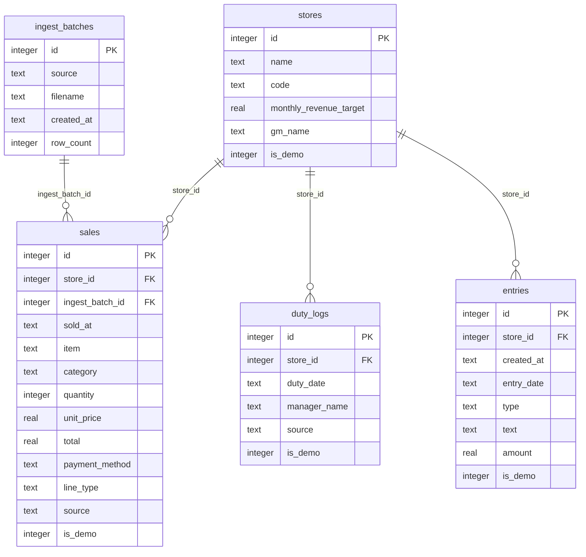
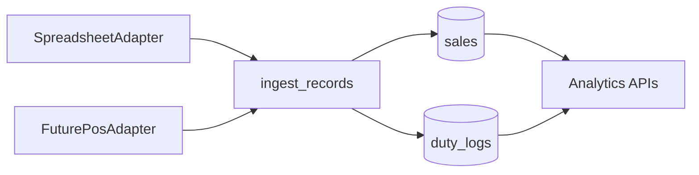
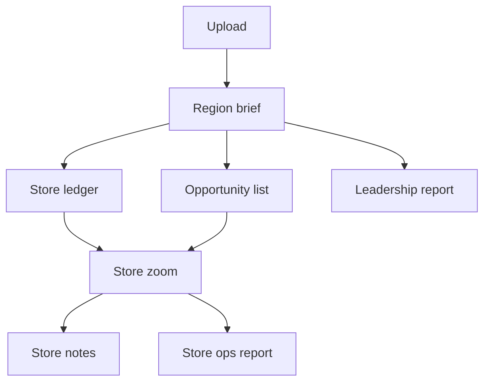
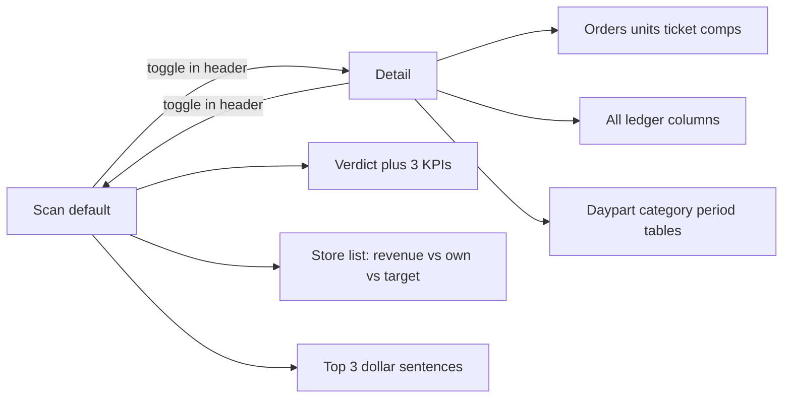

# IHOP Regional Manager Dashboard

Evolve `[ihop-analytics](C:\Users\awsom\Documents\Projects\ihop-analytics)` in place. Keep Express + SQLite + Vite/React/Recharts and local/LAN access (no login). The current app already has KPIs, charts, Excel upload, notes, and a printable report — all for **one unnamed store**. This pass makes `store` a first-class entity, adds a dollar-valued opportunity engine, and redesigns the UI as a morning brief a GM can hand to a boss.

## What exists vs what changes

Today: `sales` has no `store_id`; `[server/src/index.js](ihop-analytics/server/src/index.js)` aggregates the whole table; the UI is four tabs with generic blue-bar styling.

Needed: region + per-store **revenue totals** (not buried in a chart), breakdowns by day/week/month, by daypart and by category, comps/voids/discounts as leakage, a monthly sales target per store, manager-on-duty per store per day, rankings, same-store vs own prior, below-average callouts, opportunity $ figures, store-tied notes, two report types, and ingest that does not assume "the database is one location."

**Display rule:** in **Detail**, every revenue figure is shown with order count and items sold next to it. In **Scan**, show the dollar figure plus one companion (usually vs-prior or vs-target) so a glance stays uncluttered. Never a lone dollar amount with no context.

## Numbers that must always be visible

- **Total revenue** for the selected period (region), with orders, units, avg ticket, vs prior period, vs the sum of store targets
- **Total revenue by store** as a ledger (the primary table, not a chart): revenue, orders, units, ticket, vs own prior $/%, vs region average, vs that store's target, comps/voids $
- **By day / week / month** — a real totals table with a granularity toggle, not only a trend line
- **By store × daypart** — breakfast / lunch / afternoon / dinner / late night revenue (plus orders/units)
- **By store × category** — pancakes, combos, omelettes, etc.
- **Comps, voids, discounts** — dollars taken off the top; net vs gross so leakage is obvious
- **Vs target** — each store has a monthly revenue goal the manager can edit; progress and gap are first-class
- **Manager on duty** — who ran each store each day, used to explain spikes/dips (not full HR/server sales)

## Data model and future-proof ingest

Canonical tables (SQLite, same file `[server/ihop.db](ihop-analytics/server/ihop.db)`):

- **stores** — `id`, `name`, `code` (optional store #), `monthly_revenue_target` (editable), `gm_name` (optional default GM), `is_demo`
- **sales** — existing columns **plus** `store_id`, `ingest_batch_id`, `line_type` (`sale` | `discount` | `comp` | `void`), `is_demo`. Net revenue = sum of `sale` totals minus comps/voids/discounts. Gross = sales only.
- **duty_logs** — `id`, `store_id`, `duty_date`, `manager_name`, `source` (`seed` | `upload` | `manual`), `is_demo`. One manager-on-duty per store per day (`UNIQUE(store_id, duty_date)`).
- **ingest_batches** — `id`, `source` (`seed` | `upload` | reserved `pos_api`), `filename`, `created_at`, `row_count`
- **entries** — existing columns **plus** `store_id`, `is_demo` (promos/waste/events — separate from who was MOD)

### Database ERD

Five tables. `stores` is the hub. `sales` is the fact table. `duty_logs` is one MOD row per store per calendar day. `entries` are freeform notes. `ingest_batches` records how a set of sales (and optional MOD names) got in, so a future POS adapter is another batch `source`, not a new schema.

Indexes: `sales(store_id, sold_at)`, `sales(item)`, `duty_logs(store_id, duty_date)` unique, `entries(store_id, entry_date)`. `line_type` is `sale` | `discount` | `comp` | `void`. `ingest_batches.source` and `sales.source` are `seed` | `upload` | `pos_api`. `duty_logs.source` also allows `manual`. `entries.type` is `note` | `promo` | `waste` | `event`.

All analytics query `sales` by `store_id` + date range. Spreadsheet upload is one **adapter** that emits canonical line items; a later POS job would emit the same shape and call the same `ingest(records, batch)` function. No analytics code should know or care whether a row came from Excel.

**Demo wipe (your rule):** seed writes `is_demo=1` on stores, sales, duty_logs, and entries. The **first successful real ingest** deletes every demo store, sale, duty log, entry, and batch in one transaction, then inserts the real rows. Subsequent uploads append. Combined files create/match stores from a Store column; single-store files require picking or naming a store in the upload UI.

## Seeded demo region (until real data)

Six stores with **deliberately different profiles** so every finding type fires on first load (names are placeholders, not a real region). Each has a named GM, a monthly target, rotating managers-on-duty, and a comps/voids rate:

- **Westfield** — strongest, healthy breakfast, on/above target, low comps
- **Riverside** — shrinking vs its own prior period, missing target
- **Oakton** — below regional average, weak lunch mix, **high comps/voids** (leakage)
- **Brookside** — under-indexes on a region-winning item (e.g. Breakfast Sampler)
- **Fairview** — local hit worth spreading (e.g. Cinn-A-Stack over-indexes)
- **Lakewood** — weak dinner mix, mid pack overall

Seed a few spike/dip days with a different MOD than usual so the store page can say *"Tuesday 9/2 dipped 18% — Jordan Lee on duty; note logged: kitchen printer down."*

Reseed remains `npm run seed`. Empty state after wipe: one sentence + Upload.

## Upload parser

Extend `[server/src/index.js](ihop-analytics/server/src/index.js)` (extract `ingest.js` + `parseSpreadsheet.js`):

- Forgiving headers: Date / Business Date, Time, Item / Menu Item, Category, Qty, Unit Price / Price, Total / Amount / Sales, Store / Location / Store #, Payment, **Type / Line Type** (`sale`/`comp`/`void`/`discount` — default `sale`), **Manager / MOD / Manager On Duty**
- Combined file: require a store column; auto-create stores from new names after demo wipe
- Single-store file: store picker (or "new store" name); optional filename hint
- Manager column (if present) upserts `duty_logs` for that store + date; missing manager is fine
- Same first-sheet, skip-bad-rows, computed totals behavior as today
- Template download includes Store, Line Type, and Manager columns, plus a one-row example of a comp and a void

## Opportunity engine (always a dollar figure)

New `[server/src/opportunities.js](ihop-analytics/server/src/opportunities.js)`. Compare the selected period to an equal-length prior period. Monthly-ize with `30 / period_days`. Label every card **Estimated monthly opportunity** (mix gap, not a guarantee).

| Finding                | Logic                                                                    | $ formula                                              |
| ----------------------- | ------------------------------------------------------------------------ | -------------------------------------------------------- |
| Item under-index       | Store units/order for a top regional item is ≥20% below the region rate | `gap_per_order × store_orders × price × month_factor`  |
| Local winner           | One store's mix ≥1.5× region; other stores could close half the gap     | sum of half-gaps × their volume × price × month_factor |
| Daypart / category gap | Store mix share ≥5 pts below region share                               | `share_gap × store_revenue × month_factor`             |

Skip tiny samples. Rank by monthly $. Copy is one sentence, e.g. *"Brookside sells 40% fewer Breakfast Samplers than the region. Closing that gap is worth about $1,200 a month."*

Same-store growth is **not** mixed into rankings as the only signal: each store shows vs **its own** prior $ and %, and separately vs region average.

## API shape (additive)

Date range stays `from`/`to`. Add optional `storeId`. Revenue payloads always include `{ revenue, orders, units, avgTicket }` (net unless noted).

- `GET /api/stores` — includes `monthly_revenue_target`, `gm_name`; `PATCH /api/stores/:id` to edit target / GM name
- `GET /api/region/summary` — **total net revenue**, gross, comps/voids/discounts $, orders, units, avg ticket, vs prior, vs sum of targets, trend
- `GET /api/revenue?grain=day|week|month` — totals table for the range (region or one store)
- `GET /api/stores/ranking` — **revenue by store** ledger: net, gross, comps, orders, units, ticket, vs-own, vs-region, vs-target, below-average flag
- `GET /api/stores/dayparts` and `GET /api/stores/categories` — store × daypart and store × category matrices
- `GET /api/duty?storeId&from&to` — managers on duty; `PUT /api/duty` to set/override a day (manual)
- `GET /api/opportunities` — ranked findings with `monthlyDollars`, `storeId`, `kind`, sentence
- Existing summary/trend/items/categories/dayparts — filter by `storeId` when present
- `GET /api/report?scope=store|region&storeId=` — two payloads
- Upload / entries — store-aware; demo wipe on first real upload

## Screens (what a manager actually opens)

Routes (add `react-router-dom`; Express already falls back to `index.html`): `/`, `/stores/:id`, `/opportunities`, `/reports`, `/upload`, `/notes`.

1. **Region brief (home)** — **Scan (default):** one verdict sentence (**total revenue**, vs prior, vs target, named opportunity $). Three large KPIs (net revenue, vs target, leakage or opportunity $). Store ledger with a short column set: store, revenue, vs own, vs target, one status word (on track / below avg / missing target). Top 3 opportunity sentences. Optional sparkline, no matrices. **Detail:** full KPI row (orders, units, avg ticket, comps/voids, vs target). Full ledger columns. Day/week/month totals table. Store × daypart and store × category. Top 5+ opportunities. Trend chart; clicking a day shows managers on duty. Click a store or a finding to drill in.
2. **Store zoom** — **Scan:** that store's revenue, vs own, vs region, vs target, status sentence, top 3 items, this store's top opportunities. **Detail:** orders/units beside every $, comps leakage, day/week/month table, daypart and category breakdowns, full item list, **manager-on-duty** list with spike/dip days highlighted, notes.
3. **Opportunities** — **Scan:** ranked one-liners with $. **Detail:** method sentence, period math, store link, supporting mix numbers.
4. **Notes + duty** — notes still require a store (promo/waste/event). Duty log is a separate short form: store, date, manager name (also filled from uploads).
5. **Upload** — file drop + store mapping; optional Manager and Line Type columns.
6. **Reports** — toggle Store ops vs Leadership. Print / Save PDF as today.
   - **Store ops:** totals, vs-region, vs-target, comps, daypart/category, $ findings, notes, MOD on best/worst days.
   - **Leadership:** **region total revenue**, full **revenue-by-store table**, vs targets, comps leakage, top $ findings, best/worst named stores with same-store growth, below-average callouts, MOD named on the region's best and worst days. This is the boss packet.

## Visual direction (executive, not generic SaaS)

This is an ops dashboard, not a marketing page. Design it as a **morning GM packet**: a 10-second scan answers "how is the region and who needs me," with a **Scan / Detail** toggle when they need the supporting numbers.

### Scan vs Detail (one global toggle)

A single control in the header, default **Scan**, remembered in `localStorage`, same mode on region home, store zoom, and opportunities. Not per-card expand/collapse as the main pattern — one switch, whole page.

- **Scan (default):** a brief pass should be enough. First viewport, no hunting: verdict sentence, 3 large numbers, store list with status, top money findings. Big type, short labels, few columns. Status is a word plus $ (not color alone). Hide grain tables, matrices, extra KPI chips, MOD calendar, and long charts.
- **Detail:** the same page, more rows and columns — orders/units beside revenue, comps/voids, vs-region, day/week/month table, store × daypart and store × category, full opportunity math, trend with MOD on spike days. This is "I need to explain this number" mode.
- **Test:** someone who has never used the app can name region revenue, the worst store, and the biggest $ opportunity after a few seconds on Scan. Detail is for the follow-up, not the first read.
- Leadership **print** uses the Scan hierarchy (verdict + store table + top findings) even if the on-screen toggle is Detail, so the boss packet stays short.

### Look

- Light paper ground, diner-blue ink, pancake-gold for the one accent, strawberry-red only for "needs attention" **with a text label**
- Display serif for titles (e.g. Fraunces / Newsreader), IBM Plex Sans for UI, tabular figures for money — not Inter, not a purple gradient
- Home is a brief, not a 2×2 pie/bar grid. Category pies stay off the region home (bars or a table instead, and only in Detail; pie only if ≤5 slices on store Detail)
- Persistent left rail on desktop: Region, Opportunities, ranked store list, Reports, Upload, Notes. Store deep-link preserved
- Print CSS: hide chrome, keep numbers and sentences; print layout follows Scan density

## Implementation order

Move the agent workspace to `[ihop-analytics](C:\Users\awsom\Documents\Projects\ihop-analytics)` before editing.

1. Schema (including `line_type`, `monthly_revenue_target`, `duty_logs`) + `ingest()` + demo wipe + multi-store seeder
2. Parser + upload UI (combined vs single store, comps/voids, manager column)
3. Revenue APIs (region total, by store, grain day/week/month, store×daypart, store×category, vs-target, comps) + ranking + opportunity engine + duty CRUD + target PATCH
4. Frontend shell + Scan/Detail toggle + region brief (Scan first) + store zoom
5. Notes, duty editor, dual reports, print (Scan hierarchy)
6. Browser pass: Scan glance (verdict, worst store, top $ finding) → toggle Detail (period/daypart/category/MOD) → target edit → notes → upload wipe → empty → re-upload → both reports

Out of scope: auth, hosted deploy, live POS connector (interface only), mobile-native app, **per-server/cashier sales, tips, and labor hours** (manager-on-duty only for employee data in this version). Desktop-first; tables must remain readable on a laptop.
